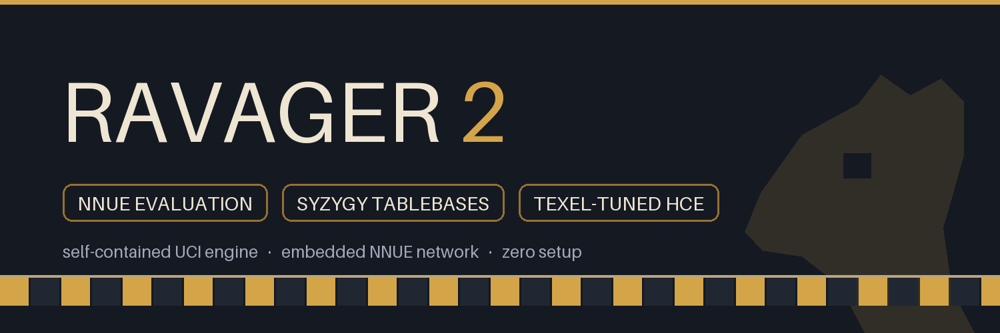

<p align="center">
  
</p>

<p align="center">
  <a href="#strength"></a>
  <a href="LICENSE"></a>
  
  
</p>

---

**Ravager 2** is a 3194-rated CCRL 40/15 self-contained UCI chess engine: an
efficiently-updatable neural network (NNUE) evaluation, Syzygy endgame
tablebase probing, and a texel-tuned handcrafted fallback eval — all compiled
into one binary with the network **embedded**. Download it, point your GUI at
it, play. The only optional setup is a `SyzygyPath`.

## ✦ Features

- **NNUE evaluation** — `(768→H)x2` dual-perspective accumulator updated
  incrementally during search; king-bucket changes repair lazily.
- **Dual net formats** — loads Ravager-format nets *and* Leorik-format
  bucketed SCReLU nets (`<H>HL-S-<K>io<O>-*.nnue`) natively.
- **Embedded network** — the bundled Leorik net is compiled into the binary
  via incbin; no external files, ever.
- **Syzygy tablebases** — WDL probes inside the search (Pyrrhic, vendored),
  DTZ-optimal root moves; blessed/cursed results honour the 50-move rule.
- **Texel-tuned HCE** — full fallback evaluation, optimised on the Zurichess
  quiet-labeled set with golden-section K search.
- **Modern search** — PVS + aspiration, TT, killers/countermoves,
  butterfly + continuation history, LMR/LMP, RFP/razoring/futility,
  adaptive null move, ProbCut-lite, singular extensions, SEE-pruned qsearch.

## ✦ Strength

| Engine | CCRL 40/15 | CCRL 40/2 |
|---|---:|---:|
| Ravager 2 | **3194** | |

## ✦ Build

```bash
make            # self-contained binary, NNUE net embedded (~5 MB)
make EVALFILE=  # HCE-only binary (~170 KB), no net
make EVALFILE=path/to/net.nnue   # embed a different net
make net        # re-download the default net if missing
make tuner      # texel tuner binary
./ravager bench # fixed-depth benchmark
```

Prebuilt binaries live on the
[releases page](../../releases) — Linux and Windows, both with the
net embedded. Zero configuration required except an optional `SyzygyPath`.

## ✦ UCI options

| Option | Type | Default | Description |
|---|---|---|---|
| `Hash` | spin | 256 | Transposition table size in MB (1–65536). |
| `MoveOverhead` | spin | 20 | Safety margin in ms subtracted from engine time budgets. |
| `Ponder` | check | false | Accepted; ponder moves are emitted but pondered search is not implemented. |
| `Use NNUE` | check | true | Evaluate with the loaded NNUE net; `false` switches to the tuned handcrafted eval. |
| `EvalFile` | string | *(embedded)* | Path to an `.nnue` file (Ravager or Leorik format, auto-detected). Empty reloads the embedded net. |
| `SyzygyPath` | string | \<empty\> | Directory of Syzygy `.rtbw`/`.rtbz` files (`:`/`;` separated lists work). Probing activates when tables are found. |
| `SyzygyProbeLimit` | spin | 6 | Probe WDL during search only when men on board ≤ limit (also capped by available tables). |
| `Syzygy50MoveRule` | check | true | Score cursed wins / blessed losses as draws. |

Environment conveniences: `RAVAGER_EVALFILE=<net>` preloads a net at startup;
`RAVAGER_NNUE_VERIFY=1` enables the accumulator self-check (slow, debugging).

## ✦ Tools

| command | purpose |
|---|---|
| `./ravager bench` | fixed-depth benchmark |
| `./ravager perft <d>` | move-generator verification |
| `./ravager datagen <games> <ms> <seed> <out>` | self-play training data |
| `make tuner && ./tuner data.epd out.c [rounds]` | texel tuning (EPD or datagen format) |
| `python3 tools/verify_leorik.py <net> <fens…>` | independent NNUE forward-pass reference |

## ✦ Credits

Ideas synthesised from the classic HCE engines — Stockfish, Komodo, Houdini,
Ethereal, Shredder, Rybka (see [CREDITS.md](CREDITS.md)). Bundled
third-party components: **Pyrrhic** (Syzygy probing, MIT, `src/tb/LICENSE`),
**incbin.h** (graphitemaster), **Leorik** nets (Thomas Jahn, MIT), and the
**Zurichess** quiet-labeled tuning dataset.

## ✦ License

[MIT](LICENSE) © erensh27
