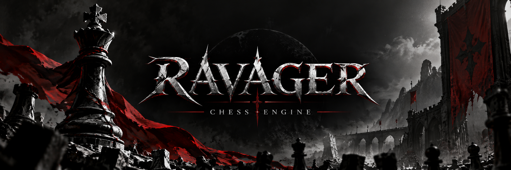

# Ravager Fury



A UCI chess engine written in C11, pairing Ravager's own search with an embedded NNUE and a tuned handcrafted evaluation fallback.

## Installation

For a non-development build, simply navigate to the [releases page](https://github.com/erensh27/Ravager3/releases) and download the latest release.

For the latest development build, you can clone the repository and build it yourself:

1. Clone the repository:

```bash
git clone https://github.com/erensh27/Ravager3.git
```

2. Build the engine:

```bash
make -j$(nproc)
```

## Strength

| Version | CCRL 40/15 |
| ------- | ---------- |
| Ravager 2 | 3324  |
| Ravager Fury | TBD |

*Ravager 2.0 64-bit on the [CCRL 40/15 complete list](https://computerchess.org.uk/4040/rating_list_all.html), published October 2, 2026. Ravager Fury is left blank until it has an official rating.*

## Logistics & Features

Ravager Fury is an alpha-beta engine with a powerful neural-network evaluation at its core.

### Search

- Principal Variation Search (PVS) with iterative deepening & dynamic aspiration windows
- Transposition table bucketed replacement strategy by depth/age, mate-score adjustment, and memory prefetching
- Move ordering using SEE/MVV-LVA capture ordering, killer moves, countermoves; history for butterfly, continuation, and captures
- Check/double-check, singular/double extensions
- Multi-cut pruning, internal iterative reduction (IIR)
- History-aware late-move reductions (LMR)
- Adaptive verified null-move pruning & ProbCut-lite
- Reverse futility pruning, razoring, late-move pruning, and quiet/capture SEE pruning
- Quiescence search includes stand pat, captures/promotions, delta pruning, and legal check evasions
- Endgame handling with Syzygy WDL/DTZ tablebase probing, fifty-move rule, insufficient material, and mate-distance
- Multithreading with Lazy SMP (independent root workers with private search/NNUE state and a shared TT)

### Moves and board representation

- 64-bit bitboards with PEXT and magic slider attack generation
- Incremental board state and Zobrist hashing
- Orthodox chess and full Chess960/FRC (handles overlapping/stationary castling)
- X-FEN and Shredder-FEN support for castling rights

### Evaluation

- CC0 network natively embedded in Linux binaries
- 1,024 int16 accumulator lanes per perspective
- 16 physical king buckets with horizontal mirroring
- Piece-square, threat, and same/adjacent-file pawn-pair inputs
- CReLU paired multiplication; sparse `1024 -> 32`; Hard-Swish-6, gated residual `32 -> 64 -> 32`; linear `32 -> 1`
- Eight material-selected output buckets, exact float32/FMA inference
- Scalar/AVX2/AVX512 runtime kernels with lazy incremental accumulators
- Tuned handcrafted evaluation fallback when NNUE is off

## UCI Options

| Option | Default | Range / purpose |
| ------ | ------- | --------------- |
| Threads | 1 | 1-4096 search workers (LazySMP) |
| Hash | 256 | 8-16384 MB, shared across workers |
| UCI_Chess960 | false | Enable Chess960 king-to-rook castling notation |
| MoveOverhead | 20 | 0-5000 ms |
| Use NNUE | true | Use neural evaluation; false selects the handcrafted fallback |
| EvalFile | empty | External compatible network; empty restores the embedded net |
| SyzygyPath | empty | Tablebase directory |
| SyzygyProbeLimit | 6 | 1-7 pieces |
| Syzygy50MoveRule | true | Respect the fifty-move rule in tablebase probing |

